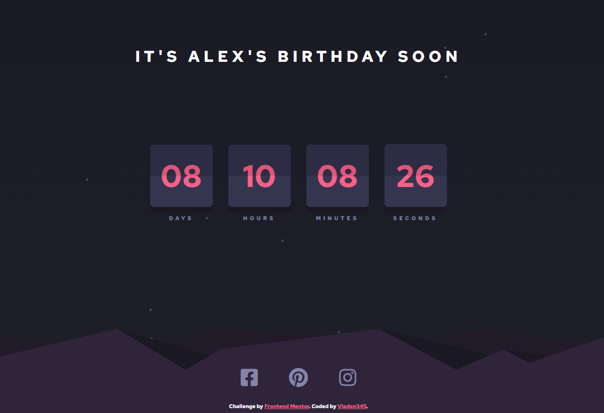

# Frontend Mentor - Launch countdown timer solution

This is a solution to the [Launch countdown timer challenge on Frontend Mentor](https://www.frontendmentor.io/challenges/launch-countdown-timer-N0XkGfyz-). Frontend Mentor challenges help you improve your coding skills by building realistic projects.

## Table of contents

- [Overview](#overview)
  - [The challenge](#the-challenge)
  - [Screenshot](#screenshot)
  - [Links](#links)
- [My process](#my-process)
  - [Built with](#built-with)
  - [What I learned](#what-i-learned)
  - [Continued development](#continued-development)
- [Author](#author)

## Overview

### The challenge

Users should be able to:

- See hover states for all interactive elements on the page
- See a live countdown timer that ticks down every second (start the count at 14 days)
- **Bonus**: When a number changes, make the card flip from the middle

### Screenshot

### Links

- Solution URL: [Solution](https://github.com/vladan345/birthday-countdown)
- Live Site URL: [Live Preview](https://vladan345.github.io/birthday-countdown/)

## My process

### Built with

- Semantic HTML5 markup
- CSS custom properties
- SCSS
- Flexbox
- CSS Grid
- Mobile-first workflow
- JS

### What I learned

Learned how to compare and use Date() object, how to animate flip-flop animation.

### Continued development

First, this started as an animation challenge, simple countdown function wasn't too hard, but then I had an idea to make this countdown as a birthday reminder (I have a bad memory for my friend's birthdays). So really, for now, I'll wait and see if everything works and maybe optimize and write cleaner code, other than that, is pretty much a finished project.

## Author

- Website - [Vladan345](https://github.com/vladan345)
- Frontend Mentor - [@vladan345](https://www.frontendmentor.io/profile/vladan345)
